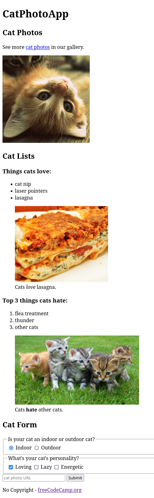
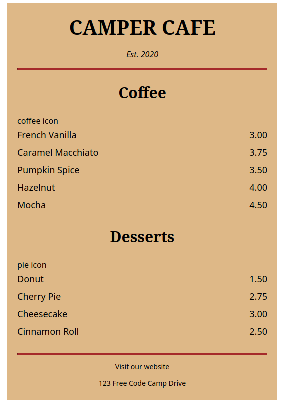
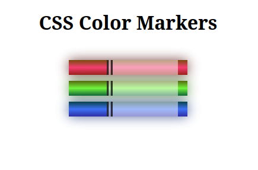
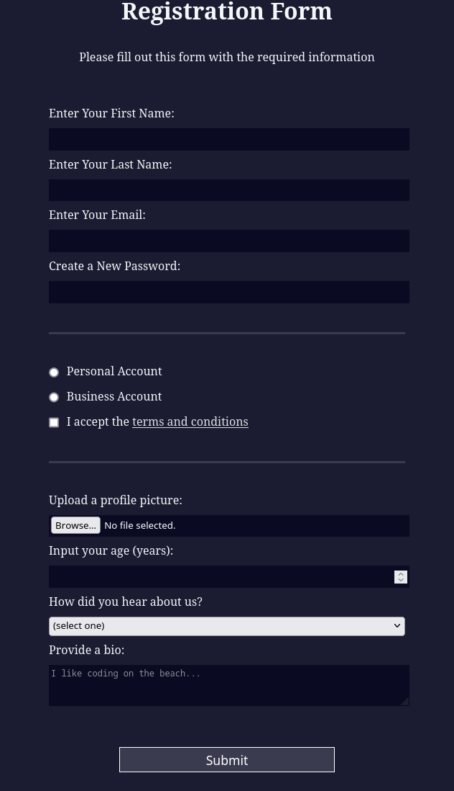

# Responsive Web Design Certification

    <h2>About</h2>
    

        
        
        
    

In this [Responsive Web Design Certification](https://www.freecodecamp.org/learn/2022/responsive-web-design/) from [FreeCodeCamp](https://www.freecodecamp.org/), it will be used languages that developers use to build webpages: HTML (Hypertext Markup Language) for content, and CSS (Cascading Style Sheets) for design.

It consists of 15 courses, each one with a lab exercice, and 5 projects:

| Course                                                            |       Status       | About | Code                              |
|-------------------------------------------------------------------|:------------------:|-------|-----------------------------------|
| Learn HTML By Building a Cat Photo App                            | :heavy_check_mark: |  [Here](#course-1---learn-html-by-building-a-photo-cat-app)     | [CatPhotoApp](./CatPhotoApp.html) |
| Learn Basic CSS By Building a Cafe Menu                           | :heavy_check_mark: |    [Here](#course-2---learn-basic-css-by-building-a-cafe-menu)   | [Cafe Menu](./Course2-CafeMenu/)          |
| Learn CSS Colors By Building a Set of Colored Markers             | :heavy_check_mark: |  [Here](#course-3---learn-css-colors-by-building-a-set-of-colored-markers)     | [Colored Markers](./Course3-ColorMarkers/)                              |
| Learn HTML Forms By Building a Registration                       | :heavy_check_mark: |[Here](#course-4---learn-html-forms-by-building-a-registration)       | [Registration Form](./Course4-RegistrationForm/)                                   |
| Learn the CSS Box Model By Building a Rothko Painting             |         :x:        |       |                                   |
| Learn CSS Flexbox By Building a Photo Gallery                     |         :x:        |       |                                   |
| Learn Typography By Building a Nutrition Label                    |         :x:        |       |                                   |
| Learn Accessibility By Building a Quiz                            |         :x:        |       |                                   |
| Learn More About CSS Pseudo Selectors By Building a Balance Sheet |         :x:        |       |                                   |
| Learn Intermediate CSS By Building a Picasso Painting             |         :x:        |       |                                   |
| Learn Responsive Web Design By Building a Piano                   |         :x:        |       |                                   |
| Learn CSS Grid By Building a Magazine                             |         :x:        |       |                                   |
| Learn CSS Animation By Building a Ferris Wheel                    |         :x:        |       |                                   |
| Learn CSS Transforms By Building a Penguin                        |         :x:        |       |                                   |
---

## Courses

### Course 1 - Learn HTML By Building a Photo Cat App

> Understand the main concepts of HTML: tags, attributes, classes, ID, grouping tags, \ tags and more  
       
 

 

### Course 2 - Learn Basic CSS By Building a Cafe Menu
> Tags and good practices: \
, \<section>, \<article>, pseudo-classes involved with links:
> - :hover
> - :active
> - visited

 

### Course 3 - Learn CSS Colors By Building a Set of Colored Markers

> Understand core concepts involved with color styling in CSS:
> - linear-gradient(direction, colors)
> - Color Models: RGB & RGBA, HSL & HSLA, CMYK
> - box-shadow(offsetX, offsetY, blur, spread, color): syntax, how to use it
> - opacity

 

### Course 4 - Learn HTML Forms By Building a Registration
> Forms best practices and acessibility
> - \<input> \<textarea> \<select> \<option> \<button> \<legend> \<fieldset> \<>
> - Different input types: text, email, password, number, file, radio, checkbox, submit
> - Attributes: name, value, action, method, minlenght, pattern, min, max, etc, for, cols, rows, type
> - Different measure units: rem and em, vh and vw

